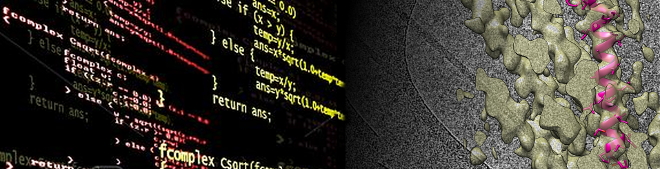

# UCSB: iQB2 - Structural Biology Modlule



## Homework

Homework was posted [here](https://github.com/nv-ucsb-courses/iqb2_F26/tree/main/homework). Return by email (nvo@ucsb.edu) by October 14th, 11:59PM.

<br>

## Presentation Order

| Name               |  Time          | 
|--------------------|----------------|
| **Brennen**        |  10:00 - 10:30 | 
| **Parker**         |  10:30 - 11:00 | 
| *Break*            |  11:00 - 11:10 | 
| **Jenny**          |  11:10 - 11:40 | 
| **Sonny**          |  11:40 - 12:10 | 
| *Lunch Break*      |  12:10 - 1:10  |   
| **Sarah**          |  1:10 - 1:40   | 
| **Alec**           |  1:40 - 2:10   | 
| *Break*            |  2:10 - 2:30   | 
| **Alex**           |  2:30 - 3:00   | 
| **Ludwig**         |  3:00 - 3:30   | 
| *Wrapup*           |  3:30 - 4:00   | 

As you can see, the schedule is pretty tight. Please make sure you do not go over your alloted time, otherwise I will have to cut you off. 

<br>

## General Information

|               | Name                  | Email                    | 
----------------|-----------------------|--------------------------|
|**Instructor** | Niels Volkmann        | nvo@ucsb.edu             | 
|**TA**         | Trent Llewellyn       | trentllewellyn@ucsb.edu  |
|               |                       |                          |
|**Location**   | BSIF 1211             |                          |

## iClicker
We will use iClicker in class starting on Thursday 11/25. If you have not already done so, please make sure you have a UCSB iClicker student account ready. 
The join link for the course is [here](https://join.iclicker.com/QCSZ). If the ink does not work, try searching for "iQB2 - Structural Biology Module" in the iClicker search interface. 
Be aware that the in-class iClicker activities will count towards your grades. I will give credit for participation only, the correctness of the answers will not influence the grades. 

## Grading
20% Participation including iClicker polls and quizzes, 25% Practicals, 25% Presentation, 30% written Homework

## Presentation Format
20 minutes presentation (sharp), + 10 minutes for questions. Papers can either be selected from the list provided 
[here](https://www.dropbox.com/scl/fo/kv4v3au5fki352e3mszg8/h?rlkey=8nesful6u3hpb1r26u5x9wdly&dl=0) (first come first serve) 
or from the general literature upon approval by the instructor. 

## Course Schedule
The following is the approximate schedule for this course. Exact order is subject to change.

|Day	| Date	| 10:00-10:50	| 10:50-11:05	| 11:05-12:00	| 12:00-1:00 | 1:00-4:00  |
|-----|-------|-------------|-------------|-------------|------------|------------|
|Monday	| 09/28	| Lecture	| Short Break	| Lecture	| Lunch Break	| Processing Practicals |
|Tuesday  | 09/29	| Lecture	| Short Break	| Lecture	| Lunch Break	| Processing Practicals |
|Thursday	| 10/01	| Lecture	| Short Break	| Lecture	| Lunch Break	| Processing Practicals |
|Friday	| 10/02	| Letcure	| Short Break	| Lecture	| Lunch Break	| CryoEM Facility Visit |
|Monday	| 10/05	| Lecture	| Short Break	| Lecture | Lunch Break	| Processing Practicals |
|Tuesday	| 10/06	| Lecture	| Short Break	| Lecture | Lunch Break	| CryoEM Sample Prep Lab Visit |
|Thursday	| 10/08	| Lecture	| Short Break	| Processing Practicals | Lunch Break	| Processing Practicals |
|Friday	| 10/09	| Presentations	| Short Break	| Presentations	| Lunch Break	| Presentations |

<br>
<br>

<!--
## Login Instructions
Replace the '#' signs in the code blocks below with your assigned number (see table)

### Powershell (Windows)

```
$env:DISPLAY="localhost:0.0"

ssh -Y user0#@lama.chem.ucsb.edu

     password: igb2_user0#

cd practicals/relion/tutorial
relion &
```
### Terminal (Apple or Linux)

```
ssh -Y user0#@lama.chem.ucsb.edu

     password: igb2_user0#

cd practicals/relion/tutorial
relion &
```
<br>
-->

<!--
## User/GPU Assignments

| Name      | # | GPU id |
|-----------|---|:------:|
| Brennen   | 1 |    0   |
| Pearly    | 2 |    0   |
| Katherine | 3 |    1   |
| Max/Ani   | 4 |    1   |
| Xieergai  | 5 |    2   |
| Binbin    | 6 |    2   |
| Izaiah    | 7 |    3   |
-->
